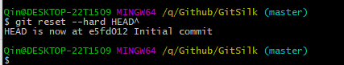

# GitSilk
软件工程课程git练习

## Git的练习与使用

### 1.在Github上创建仓库

### 2.拉取到本地：

### 3.查看当前状态：

### 4.修改项目并查看状态

### 5.提交项目并查看修改情况

### 6.SouceTree打开项目并提交

### 7.查看远程仓库情况

### 8.回退到上次版本

查看

另外:
回退到上上次:

> git reset --hard HEAD^^

回退到100版本：

> git reset --hard HEAD~100

### 9.回到未来的版本：

看分支树：已经回到未来的版本了：

### 10.创建分支

再看SouceTree 已经在Qin这个分支了

### 11.在新分支做修改 并查看修改情况

### 12.回到Master分支，并完成分支合并

### 13.删除原来有的分支

### 14.从远端拉取内容

------

## Gitlab安装

### 1.使用虚拟机安装好 Ubuntu16.04

### 2.先下载依赖：

### 3.老师所给博客无法正确下载并安装 根据自己的切身体会 亲测使用如下资料可以下载并正确安装 资料来源：StackOverflow

> I gave up with the "full" automated script, as it doesn't appear to be working with 17.04... 
> Anyway. I grabbed the latest package from https://packages.gitlab.com/gitlab/gitlab-ce/packages/ubuntu/xenial/gitlab-ce_9.3.0-ce.0_amd64.deb
> curl -LJO https://packages.gitlab.com/gitlab/gitlab-ce/packages/ubuntu/xenial/gitlab-ce_9.3.0-ce.0_amd64.deb/download
> Installed it with the package manager
> sudo dpkg -i gitlab-ce_9.3.0-ce.0_amd64.deb
> Then configured it with
> sudo gitlab-ctl reconfigure

### 4.更改配置，打开防火墙

### 5.修改初始密码，并登陆

### 6.创建项目：

